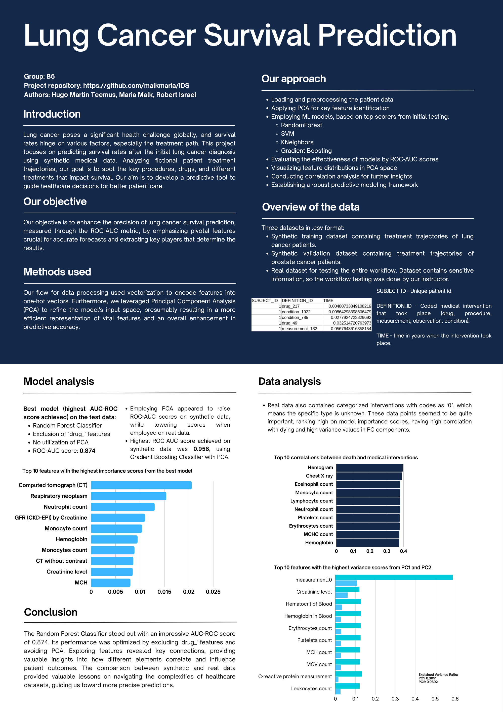

This repository is cloned, original can be found here: https://github.com/malkmaria/IDS

# IDS Project Repository
**Topic - Lung Cancer Survival Prediction**  

**Authors - Maria Malk, Robert Israel, Hugo Martin Teemus**  

**Group - B5**  

## Motivation and goal
Lung cancer poses a significant health challenge globally, and survival rates hinge on various factors, especially the treatment path. 
This project focuses on predicting survival rates after the initial lung cancer diagnosis using synthetic medical data. 
Analyzing fictional patient treatment trajectories, our goal is to spot the key procedures, drugs, and different treatments that impact survival. 
Our aim is to develop a predictive tool to guide healthcare decisions for better patient care.

## Files in the repository
**Project workflow.ipynb** - Contains the complete workflow of our project. Notebook consists of:  
- Loading and preprocessing the patient data
- Applying PCA for key feature identification
- Employing ML models, based on top scorers from initial testing:
  - RandomForest
  - SVM
  - KNeighbors
  - Gradient Boosting
- Evaluating the effectiveness of models by ROC-AUC scores
- Visualizing feature distributions in PCA space
- Conducting correlation analysis for further insights

**poster.pdf** - Informational poster about this project. 

**synthetic_data_lung_cancer.csv** - Synthetic training dataset containing treatment trajectories of lung cancer patients.  

**synthetic_data_pca.csv** - Synthetic validation dataset containing treatment trajectories of prostate cancer patients.

**B5_report** - Homework 10 tasks

**Old stuff/** - Folder containing various files and notebooks related to older workflow iterations

## Guide for using workflow notebook and replicating our analysis
0. To run our notebook, one must make sure they have Jupyter Notebook installed and configured as described in the IDS course.
1. Make sure all packages listed in the 'Imports' code block are also installed.
2. In the second code block, insert your .csv dataset path. Structure of the dataset is described in the informational poster.
3. Run all code blocks. Code blocks are named corresponding to their function, code is commented in Estonian.

Analysis is done by analyzing the printouts and graphs generated by the code blocks.  

Notebook will also produce three .csv files for further analysis:
- combined_loadings.csv - This will contain all PC loadings from the PCA. PC loadings are generated based on the last 'drop_value_combinations' value in the 'Running the workflow' code block, that the PCA is applied to.
- correlation_results.csv - Contains correlation values between the feature and 'death' column values.
- mutual_information_results.csv - Contains the results from the mutual information analysis.
